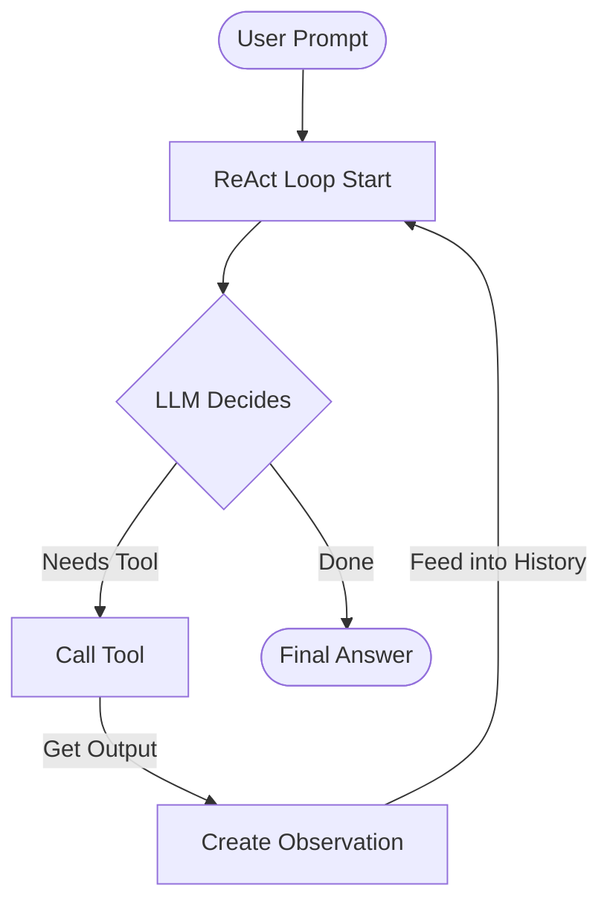

# Day 1: Build Your First AI Agent from Scratch 🤖

Welcome to Day 1 of learning **Agentic AI**! 

Rather than using complex frameworks that hide the details behind abstractions, this project implements a complete **ReAct (Reasoning and Acting)** agent in a single, readable JavaScript file. You'll see exactly how an LLM uses tools to solve multi-step problems.

---

## 💡 Core Concepts

An AI Agent is more than just a chatbot. It is a system that runs an LLM in a loop of **Reasoning** and **Acting**.



### 1. The ReAct Pattern
ReAct stands for **Reasoning + Acting**. The LLM is instructed to structure its output into distinct phases:
*   **Thought**: The LLM's internal reasoning about what to do next.
*   **Action**: A command to run a tool, formatted as `tool_name:arguments`.
*   **Observation**: The environment's response to the tool, which is fed back into the LLM.
*   **Answer**: The final response returned to the user once no more actions are needed.

### 2. Conversation History (State)
The agent maintains a history of the entire conversation:
```json
[
  { "role": "system", "content": "Instructions..." },
  { "role": "user", "content": "What is the weather in Tokyo times 2?" },
  { "role": "model", "content": "Thought: I need weather first. Action: getWeather:Tokyo" },
  { "role": "user", "content": "Observation: Rainy, 15°C" },
  { "role": "model", "content": "Thought: 15°C times 2. Action: calculate:15 * 2" },
  { "role": "user", "content": "Observation: 30" },
  { "role": "model", "content": "Thought: Ready. Answer: Weather is 15°C and times 2 is 30." }
]
```
By feeding the complete history back to the LLM at each step, the LLM is able to "remember" what it has done and decide what to do next.

---

## 🛠️ Project Files

*   [`agent.js`](file:///C:/Users/Pavilion/.gemini/antigravity/scratch/day-one-agent/agent.js): The core agent orchestrator. It manages the loop, parses responses, runs tools, and handles the CLI.
*   [`tools.js`](file:///C:/Users/Pavilion/.gemini/antigravity/scratch/day-one-agent/tools.js): Defines the javascript functions that serve as the agent's tools (`getWeather`, `calculate`, `searchWiki`).
*   [`mockLlm.js`](file:///C:/Users/Pavilion/.gemini/antigravity/scratch/day-one-agent/mockLlm.js): A mock LLM simulator to let you test the ReAct loop out of the box without an API key.

---

## 🚀 How to Run

### Step 1: Install Dependencies
Open your terminal in the `day-one-agent` folder and run:
```bash
npm install
```

### Step 2: Run in Mock Mode (Zero Configuration)
Test the agent instantly with mock reasoning:
```bash
node agent.js --mock
```

Try these interactive queries to watch the agent reason step-by-step:
1. `What is the weather in Tokyo and what is that temperature multiplied by 2?`
2. `Explain what Agentic AI is and then look up the ReAct framework.`

### Step 3: Run in Live Mode (Gemini API)
To connect the agent to a live LLM that can answer anything, set your Gemini API key:

**Windows PowerShell:**
```powershell
$env:GEMINI_API_KEY="your-api-key-here"
node agent.js
```

Now you can ask the agent any questions, and it will select, call, and compose tool observations in real-time!

---

## 🎓 Next Steps & Exercises

Once you run the project, try these exercises to expand your knowledge:
1.  **Add a new Tool**: Open [`tools.js`](file:///C:/Users/Pavilion/.gemini/antigravity/scratch/day-one-agent/tools.js), write a new function (e.g., `getCurrentTime`), register it in `toolRegistry` and add its description in `toolDescriptions`.
2.  **Experiment with Prompts**: Edit the `SYSTEM_PROMPT` in [`agent.js`](file:///C:/Users/Pavilion/.gemini/antigravity/scratch/day-one-agent/agent.js) to see how changing instructions affects how the agent reasons.
